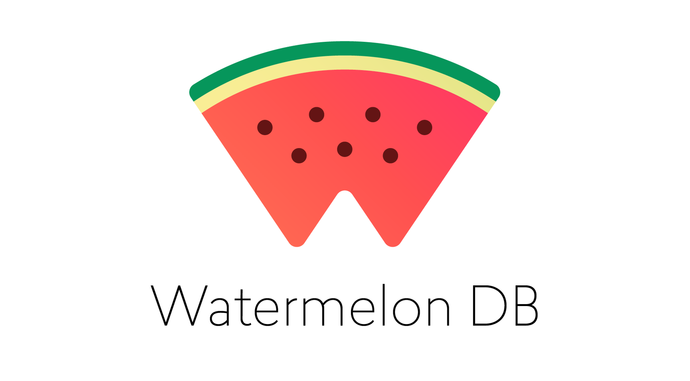

# WatermelonDB


[](https://travis-ci.org/Nozbe/WatermelonDB)
[](https://www.npmjs.com/package/@nozbe/watermelondb)

#### Next-generation React database

> Build powerful React Native and React web apps that scale from hundreds to tens of thousands of records and remain _fast_

|   | WatermelonDB |
| - | ------------ |
| ⚡️ | **Launch your app instantly** no matter how much data you have |
| 📈 | **Highly scalable** from hundreds to tens of thousands of records |
| 😎 | **Lazy loaded** everything. Only load data you need |
| ✨ | **Reactive** API with [RxJS](https://github.com/ReactiveX/rxjs) |
| 📱 | Supports iOS, Android, and the web |
| ⚛️ | Made for React. Easily plug data into components |
| ⏱ | Fast. Async. Multi-threaded. Highly cached. |
| 🔗 | Relational. Built on rock-solid [SQLite](https://www.sqlite.org) foundation |
| ⚠️ | Statically typed with [Flow](https://flow.org) |
| 🔄 | **Offline-first.** (Plug in your own sync engine) |

## Why Watermelon?

**WatermelonDB** is a new way of dealing with user data in React Native and React web apps.

It's optimized for building **complex applications** in React / React Native, and the number one goal is **real-world performance**. In simple words, _your app must launch fast_.

If you have a simple app, keep using Redux or MobX with a persistence adapter. But if you start scaling to thousands or tens of thousands of database records, you'll notice a big impact on how fast the app launches, especially on slower Android devices. Loading a full database into JavaScript is expensive!

Watermelon fixes it **by being lazy**. Nothing is loaded unless requested. And because all querying is performed directly on the rock-solid [SQLite database](https://www.sqlite.org/index.html) on a separate thread, most queries resolve in **less than 1ms**, even with 10,000 records, even on slower Android devices!

## Usage

**Quick (over-simplified) example:** an app with posts and comments.

First, you define Models:

```js
class Post extends Model {
  @field('name') name
  @field('body') body
  @children('comments') comments
}

class Comment extends Model {
  @field('body') body
  @field('author') author
}
```

Then, you connect components to the data:

```js
const Comment = ({ comment }) => (
  <View style={styles.commentBox}>
    <Text>{comment.body} — by {comment.author}</Text>
  </View>
)

// This is how you make your app reactive! ✨
const enhance = withObservables(['comment'], ({ comment }) => ({
  comment: comment.observe()
})
const EnhancedComment = enhance(Comment)
```

And now you can render the whole Post:

```js
const Post = ({ post, comments }) => (
  <View>
    <Text>{post.name}</Text>
    <Text>Comments:</Text>
    {comments.map(comment =>
      <Comment key={comment.id} comment={comment} />
    )}
  </View>
)

const enhance = withObservables(['post'], ({ post }) => ({
  post: post.observe(),
  comments: post.comments.observe()
})
```

The result is fully reactive! Whenever a post or comment is added, changed, or removed, the right components **will automatically re-render** on screen. Doesn't matter if a change occured in a totally different part of the app, it all just works out of the box!

➡️ **Learn more: [Getting Started](./docs/GettingStarted.md)** or [**see full documentation**](./docs)

## Contributing

If you have comments, complaints, or ideas for improvements, feel free to open an issue or a pull request! If you make an app using WatermelonDB, please contact us!

## Author and license

**WatermelonDB** was created by [@Nozbe](https://github.com/Nozbe). Main author and maintainer is [Radek Pietruszewski](https://github.com/radex).

**Contributors:** [@mobily](https://github.com/mobily), [@kokusGr](https://github.com/kokusGr), [@rozPierog](https://github.com/rozPierog), [@rkrajewski](https://github.com/rkrajewski), [@domeknn](https://github.com/domeknn).

WatermelonDB is available under the MIT license. See the [LICENSE file](./LICENSE) for more info.
